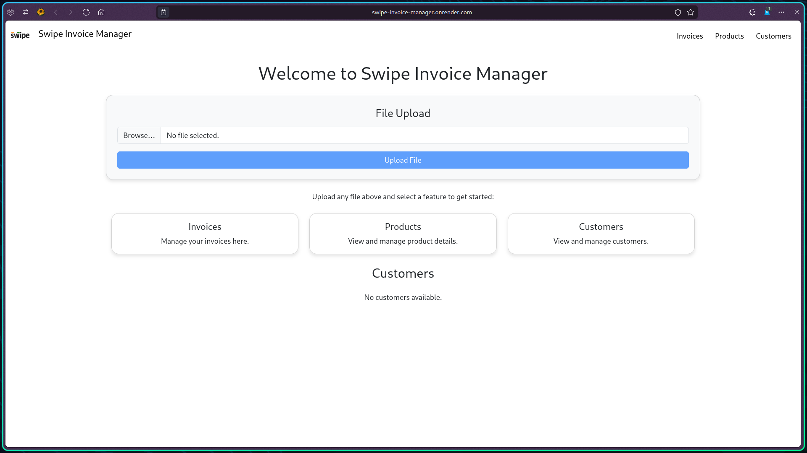

# Invoice Data Management App

A web application that automates the extraction, processing, and management of invoice data from various file formats, including Excel, PDF, and images. The app organizes extracted data into three main sections: Invoices, Products, and Customers. It uses React for the frontend, Redux for state management, and integrates AI-powered data extraction for all file types.

## Badges

## Tech Stack

**Frontend**: React, Redux, Axios

**Backend**: Node.js, Express

**Data Extraction**: Tesseract.js, PDF.js
          
**Data Extraction**: Tesseract.js, PDF.js

**vFile Formats Supported**: Excel (XLSX, XLS), PDF, Image (JPEG, PNG)

**Development Tools**: VS Code, Git, GitHub

## Visit the Website

You can explore the live version of this project by clicking on the gif:

## Feel free to connect with me!

  
  

